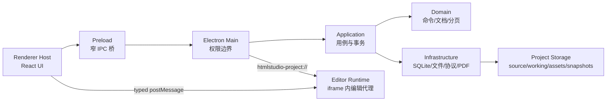

# HTML 可视化编辑器迭代记录与工程避坑手册

> 项目：SierraStudio  
> 当前目录：`D:\桌面2\html-studio`  
> 首次整理：2026-07-26  
> 最近更新：2026-07-31  
> 整合来源：
>
> - 旧迭代记录：`D:\桌面2\SierraCode\htmlstudio\html编辑器-迭代记录.md`
> - 当前仓库代码、测试和架构文档
> - 2026-07-25 至 2026-07-31 的 UI、文字、媒体、图表、PPTX、水印、桌面壳与打包修复记录

这不是逐句对话备份，而是一份可以在以后创建类似项目时直接读取的工程手册。
目标是减少重复调研和无效试错，让后续开发先建立正确边界，再增加功能。

如果历史记录、旧文档和本文件发生冲突，以“当前代码 + 本文件的当前结论”为准。

---

## 0. 新项目如何使用这份文档

### 最省 Token 的读取顺序

如果准备开发新的 HTML 编辑器、网页 PPT 编辑器或 Electron 内容工具，优先读取：

1. `1. 当前结论`
2. `3. 最终架构`
3. `6. 编辑交互的正确实现模式`
4. `11. Bug 根因库`
5. `12. 禁止事项`
6. `13. 新项目开工清单`

如果遇到具体问题，再按关键词搜索：

- 卡死：`颜色`、`selectionchange`、`预览/提交`
- 页面跳动：`reload`、`undo`、`scroll`
- 图片/视频：`媒体资产`
- 图表空白：`ECharts`、`CDN`、`脚本顺序`
- 打包后还是旧版：`release`、`win-unpacked`
- 架构混乱：`唯一事实来源`、`Command`

### 给后续 Codex/AI 的推荐开场提示

```text
先完整阅读 html编辑器-迭代记录.md。
本项目必须遵守其中的架构边界、命令模型、预览/提交模型和测试门槛。
修改前先判断属于 Host UI、Editor Runtime、Domain、Application 还是 Infrastructure；
禁止在 App.tsx 或 editor-runtime/index.ts 继续堆旁路逻辑。
实现后至少运行 typecheck、unit test 和相关 Electron E2E。
```

---

## 1. 当前结论

### 1.1 产品定位

SierraStudio 是一个本地优先的 Electron HTML 可视化编辑器，目标是：

- 导入静态 HTML、报告、HTML PPT、落地页；
- 在保持原页面结构的前提下修改文字、样式、布局和媒体；
- 同时支持文档流插入和自由画布插入；
- 支持 ECharts/Chart.js 等图表的识别与有限编辑；
- 导出 HTML 和 PDF；
- 项目、历史和资产默认保存在本地。

它不是：

- React/Vue 源码 IDE；
- 任意网站的无损反编译器；
- 可以自动理解所有业务 JavaScript 的低代码平台；
- 把任何响应式网页一键转换成 PPT 绝对定位页面的工具。

### 1.2 当前状态

以下为截至 2026-07-26 的基础状态；2026-07-31 的增量能力与边界见第 24～34 节：

- Electron + React + TypeScript 架构已稳定运行；
- 导入、项目恢复、命令日志、撤销/重做、媒体导入、PDF 导出已接通；
- 文字样式支持实时预览、提交合并、选区状态同步；
- 图片、视频、图表组件可导入真实项目资产；
- 支持格式刷；
- 支持 Flow/Free 两种插入语义；
- ECharts 5.6.0 与 `echarts-wordcloud` 2.1.0 已内置；
- 导入 HTML 中的远程 ECharts/词云依赖会映射到本地版本；
- Windows 自定义标题栏已接入，原生菜单已移除；
- 单元测试：20/20；
- 完整 Electron E2E：34/34；
- Windows 安装包和 `win-unpacked` 均已重新生成。

### 1.3 最核心的工程判断

> DOM 不是数据库，React State 不是数据库，Canvas 也不是数据模型。  
> SQLite 中的已提交操作、有效 Checkpoint 和不可变原稿才是事实来源。

> 高频交互必须分成 Preview 和 Commit。  
> Preview 只改实时画面；Commit 才形成一条可撤销、可持久化命令。

> 任意 HTML 兼容和结构化组件编辑不能混成一条旁路。  
> 原网页走兼容层；编辑器自带图表、媒体和组件走受控模型。

---

## 2. 为什么选择当前技术路线

### 2.1 Electron 而不是纯网页

HTML 编辑器需要：

- 稳定、可控的 Chromium 渲染；
- 本地文件选择；
- 项目目录和资产复制；
- SQLite；
- PDF 渲染；
- 桌面安装包与自动更新。

纯网页方案会在文件系统、跨源资源、本地视频、目录导入和 PDF 上增加大量限制。

### 2.2 为什么没有直接替换成 GrapesJS

GrapesJS 的组件、脚本依赖、Style Manager、Layer Manager 和 Undo Manager
非常值得借鉴，但直接替换现有画布会影响：

- 任意 HTML 的版式还原；
- 当前 SQLite Command/Checkpoint 体系；
- 多页报告与 PDF 分页；
- 自定义项目协议；
- 已有媒体和图表适配器。

最终选择是：

- 保留自研 Editor Runtime；
- 借鉴 GrapesJS 的组件依赖、原位撤销、属性面板和组件模型；
- 用清晰模块边界避免继续发展成无类型大脚本。

### 2.3 Flow 与 Free 必须共存

HTML 与 PPT 的布局模型天然不同：

- HTML：Block/Flex/Grid/响应式文档流；
- PPT：固定画布、绝对坐标。

因此不能把“拖动”统一解释成修改 `left/top`：

- Flow 模式下，插入和拖动优先表示重新排序或嵌入容器；
- Free 模式下，元素才转换为绝对定位。

用户必须能够明确选择，不允许一次普通点击就破坏原布局。

---

## 3. 最终架构



### 3.1 Renderer Host

主要文件：

- `src/renderer/src/App.tsx`
- `src/renderer/src/editor/CanvasViewport.tsx`
- `src/renderer/src/editor/LayerTree.tsx`
- `src/renderer/src/editor/command-coordinator.ts`

职责：

- 顶部工具栏、左侧组件库、右侧检查器、状态提示；
- 保存选择快照、当前 revision、面板状态等轻量 UI 数据；
- 将用户操作转换为类型化消息；
- 串行提交 Editor Runtime 产生的 Command；
- 调用窄化 preload API。

禁止：

- 直接访问文件系统或 SQLite；
- 把完整 HTML 长期保存在 React State；
- 在 React 事件里直接修改 iframe DOM；
- 为每个 Bug 增加一套独立保存逻辑。

### 3.2 Editor Runtime

主要文件：

- `src/editor-runtime/index.ts`
- `selection-overlay.ts`
- `flow-reorder.ts`
- `free-drag.ts`
- `image-placement.ts`
- `dynamic-nodes.ts`
- `charts/*`
- `protocol.ts`

职责：

- 在 iframe 内点击、框选、测量、拖动、缩放和文字编辑；
- 实时 Preview；
- 生成带 before/after 的领域命令；
- 原位应用 undo/redo 命令；
- 识别运行时生成节点和图表实例；
- 维护只存在于编辑器内的选框与手柄。

禁止：

- 访问 Electron/Node；
- 直接写数据库；
- 把 Overlay 写入项目 HTML；
- 每一帧都向 Host 提交命令；
- 对同一 ECharts 容器重复 `echarts.init()`。

### 3.3 Main / Preload

主要文件：

- `src/main/index.ts`
- `src/preload/index.ts`
- `src/shared/ipc.ts`

职责：

- BrowserWindow 生命周期；
- 文件选择对话框；
- HTML、图片和视频导入；
- 自定义项目协议；
- PDF 导出；
- 更新检查；
- IPC 发送者验证；
- 权限、导航、新窗口和网络边界。

Preload 必须保持：

- `contextIsolation: true`
- `nodeIntegration: false`
- `sandbox: true`
- 仅暴露明确、类型化的 API

不要把 preload 编译成依赖 `require/vm` 的字节码。沙箱 preload 中这会直接失效。

### 3.4 Domain

主要文件：

- `src/domain/commands/schema.ts`
- `src/domain/document/*`
- `src/domain/charts/*`
- `src/domain/pdf/*`

职责：

- Command schema 和 inverse；
- 工作 HTML 的确定性变换；
- 编辑器元数据剥离；
- Chart Manifest；
- PDF 分页纯函数。

原则：

- 不依赖 React；
- 不依赖 Electron；
- 命令必须版本化；
- Command 必须包含足够的 before/after 信息；
- Replay 必须验证 revision 连续性。

### 3.5 Application 与 Infrastructure

主要文件：

- `src/application/projects/project-manager.ts`
- `src/application/projects/project-session.ts`
- `src/infrastructure/sqlite/project-database.ts`
- `src/infrastructure/import/asset-importer.ts`
- `src/infrastructure/filesystem/atomic-files.ts`
- `src/infrastructure/protocol/editor-document.ts`
- `src/infrastructure/pdf/*`

Application 负责用例和事务；Infrastructure 负责具体技术。

项目导入使用 staging 目录，所有步骤成功后才原子改名，避免留下半成品项目。

---

## 4. 数据权威与项目存储

### 4.1 数据权威顺序

从高到低：

1. SQLite 中已提交的 operation head；
2. 经过校验的 checkpoint；
3. 不可变 `source/index.original.html`；
4. 派生的 `working/index.html`；
5. iframe 中的实时 DOM；
6. React 中的 UI 状态。

结果：

- DOM 崩坏可以重建；
- working 文件丢失可以重建；
- UI 状态丢失不影响项目；
- 原稿永远可以恢复；
- 数据库和画面不允许长期分叉。

### 4.2 项目目录

```text
project_<uuid>/
├── project.json
├── project.sqlite
├── source/
│   └── index.original.html
├── working/
│   └── index.html
├── assets/
└── snapshots/
```

用户项目默认位于：

```text
%APPDATA%\SierraStudio\projects
```

安装包不会包含开发者本机项目、测试文件或最近打开的 HTML。

### 4.3 Stable Node ID

工作文档中的可编辑节点使用：

```html
<section data-hs-id="node_xxx">
```

禁止用 `nth-child` 或长 CSS Selector 作为持久化身份，因为插入一个兄弟节点就会失效。

正式导出时移除编辑器 ID；如果 Chart Manifest 仍引用某节点，则转换为必要的稳定图表锚点。

### 4.4 Command 模型

当前命令包括：

- `styles.set`
- `text.set`
- `text.patchStyle`
- `attribute.set`
- `node.insert`
- `node.delete`
- `node.move`
- `chart.patch`

Command Envelope 必须包含：

```ts
{
  commandId,
  commandVersion,
  documentId,
  baseRevision,
  resultingRevision,
  payload
}
```

必须满足：

```text
resultingRevision = baseRevision + 1
```

不要记录含糊的“moveBy 10px”作为长期事实；优先记录明确 before/after。

---

## 5. 安全模型

### 5.1 导入 HTML 必须视为不可信

当前安全边界：

- iframe 与 Host 不同源；
- iframe 无 Electron、Node 和 preload API；
- 项目协议只能读取 `working/index.html` 与 `assets/**`；
- `source/`、SQLite 和 snapshots 不可通过协议访问；
- 禁止新窗口、任意导航和权限申请；
- CSP 默认阻断外部网络、对象嵌入、frame 和表单提交；
- 只允许内联用户脚本、项目脚本和受控本地 runtime。

当前 iframe 使用：

```html
sandbox="allow-scripts allow-same-origin"
```

这是为了让项目脚本、编辑运行时和自动化交互正常工作。安全依赖于：

- Host 与项目自定义协议仍然跨源；
- Main 不向 iframe 暴露 IPC；
- CSP 禁止外部连接；
- 项目协议严格白名单。

以后若更换协议或放开网络，必须重新做威胁模型，不能只看 sandbox 字符串。

### 5.2 不要简单允许所有 CDN

允许所有 `https:` 脚本虽然能快速让动态图表恢复，但会带来：

- 断网不可用；
- CDN 失效；
- 项目导出不可复现；
- 任意远程代码执行；
- 隐私和供应链风险。

当前采用：

> 常用依赖识别 → 映射为应用内置本地版本 → 未知脚本继续受限。

第一批支持：

- ECharts 5.6.0
- echarts-wordcloud 2.1.0

---

## 6. 编辑交互的正确实现模式

### 6.1 Preview / Commit

高频输入不能每个事件都提交 SQLite。

正确流程：

```text
用户拖动/输入/调色
    ↓
preview-*：只修改 iframe 实时 DOM
    ↓
短时间防抖或 pointerup/blur
    ↓
commit-*：生成一条 before/after Command
    ↓
CommandCoordinator 串行写入 SQLite
```

适用：

- 颜色；
- 字号；
- 宽高；
- 拖动；
- 文本输入；
- 图表拖点。

收益：

- 左侧画面实时更新；
- 不需要点击别处才刷新；
- 历史记录不会被每个 input 事件污染；
- Ctrl+Z 一次撤销一次用户意图；
- 避免 Host/iframe 往返形成反馈环。

### 6.2 文字选区与工具栏焦点

点击 B/I/U、颜色、字号控件时，浏览器会把焦点从 `contenteditable` 移走，
导致 Selection 丢失。

必须：

```tsx
onMouseDown={(event) => event.preventDefault()}
```

并在 Runtime 保存有效 Range。

选区样式应用后要重新读取：

- `document.queryCommandState`
- `document.queryCommandValue`
- 光标附近 computed font size

从而让右侧栏和浮动工具栏实时反映光标附近格式。

### 6.3 预防 0×0 选择框

`execCommand`、DOM 替换或撤销可能产生空节点，原选中引用仍存在，但元素尺寸已为 0。

处理规则：

- 操作前保存 HTML 和 Rect；
- 操作后检查 `isConnected`；
- 检查宽高是否变成 0；
- 异常时恢复 before HTML；
- 清除 stale selection；
- Overlay 不允许继续绘制在无效节点上。

### 6.4 Undo/Redo 必须原位应用

早期实现通过重载 iframe 实现撤销，导致：

- 滚动位置丢失；
- 页面跳回顶部/第一页；
- 选区闪烁；
- 大 HTML 卡顿；
- 动态图表重新执行。

当前模式：

1. Main/ProjectSession 移动 SQLite 历史游标；
2. Host 收到 inverse/forward Command；
3. Runtime `apply-command` 原位修改 DOM；
4. 保持滚动和大部分选择状态。

只有持久化拒绝、revision 冲突或 DOM 已无法信任时才重载权威 working copy。

### 6.5 Flow / Free 插入

插入组件必须显式携带：

```ts
placement: "flow" | "free"
```

Flow：

- 插入选中容器内部或相邻位置；
- 保持原有 Grid/Flex/Block 语义；
- 适合正文、卡片、标题、图片。

Free：

- 插入当前画布/页面的自由层；
- 使用绝对坐标；
- 适合浮层、标注和 PPT 式排版。

禁止所有左侧组件默认变成自由选框。

### 6.6 自由定位的 containing block

不能把所有 static 祖先都改成 `position: relative`。

Local Free 只在必要时修改直接父容器，并记录其 before/after。

坐标计算必须考虑：

- border/padding；
- scrollLeft/scrollTop；
- transform/zoom；
- margin；
- box-sizing；
- 画布缩放；
- writing mode。

这些逻辑应继续从 `index.ts` 抽离到几何服务，不能散落在 React 组件中。

---

## 7. 媒体资产设计

### 7.1 图片和视频不是临时 Blob

错误方案：

```text
FileReader/ObjectURL → 只在本次运行显示
```

关闭应用后 URL 失效，导出也会丢资源。

正确方案：

1. Host 打开原生文件选择框；
2. Main 读取文件；
3. 计算 SHA-256；
4. 写入项目 `assets/`；
5. SQLite 记录资产元数据；
6. Runtime 把节点 `src` 改为项目相对路径；
7. `attribute.set` 进入历史。

### 7.2 插入媒体组件必须可操作

早期图片/视频按钮只插入一个占位框，用户无法继续选择文件。

正确体验：

- 插入图片后自动选中；
- 右侧显示“导入/替换图片”；
- 双击图片占位也能触发导入；
- 视频同样有选择、替换和持久化路径；
- 加载失败显示明确占位，不允许静默空白。

### 7.3 AssetImporter

导入 HTML 需要处理：

- `img/src`
- `source/src`
- `video/poster`
- stylesheet
- script
- SVG image/use
- CSS `url()`
- `@import`
- style 标签
- style 属性

CSS 必须使用 PostCSS + value parser，禁止用正则做完整 CSS 资源解析。

当前远程 HTTP(S) 资源默认不下载；常用脚本依赖通过受控 resolver 处理。

---

## 8. 图表架构

### 8.1 图表不是图片

ECharts/Chart.js 通常由 JavaScript 在运行时生成 Canvas/SVG。

只保留空容器或删除脚本会得到空白区域。

图表分三类：

1. 编辑器自带受控图表；
2. 可识别的导入图表；
3. 无法识别的动态内容。

### 8.2 受控图表

编辑器插入的图表使用：

- `data-hs-chart`
- `data-hs-chart-data`
- `ChartBlockData`
- `chart.patch`

右侧修改数据、颜色和类型后，调用现有实例 `setOption()`。

Canvas 只是渲染结果，JSON 配置才是数据。

### 8.3 导入图表适配器

当前有：

- `EChartsAdapter`
- `ChartJsAdapter`
- `ChartRegistry`
- `Chart Manifest`

能力：

- 发现图表实例；
- 读取常用标题、图例、颜色和数据；
- 通过统一 Patch 更新；
- 保留无法完全结构化的原始高级配置。

不要承诺所有业务 formatter、插件和异步数据都能结构化编辑。

### 8.4 ECharts 重复 init 的严重 Bug

错误：

```ts
echarts.init(existingElement);
```

如果同一元素已有实例，重复 init 可能导致：

- Canvas/SVG 被清空；
- 内部状态错乱；
- 图表修改后整个区域消失；
- Overlay 引用失效。

正确：

```ts
const instance = echarts.getInstanceByDom(element);
if (instance) {
  instance.setOption(option, { notMerge: false });
} else {
  // 只有确实没有实例时才 init
}
```

### 8.5 远程依赖本地映射

真实报告引用：

```html
<script src="https://.../echarts/5.6.0/echarts.min.js"></script>
<script src="https://.../echarts-wordcloud/2.1.0/echarts-wordcloud.min.js"></script>
```

此前失败链：

1. AssetImporter 不下载远程脚本；
2. CSP 不允许 `https:` 脚本；
3. 原 HTML 初始化脚本先执行；
4. Editor Runtime 后执行；
5. `echarts` 未定义，普通折线图和词云一起空白；
6. 即使有 ECharts，缺少 wordcloud 插件仍无法绘制词云。

当前修复：

- 检测远程脚本文件名；
- 在响应阶段禁用对应远程标签；
- 注入 `htmlstudio-runtime://bundle/vendor/echarts.min.js`；
- 再注入本地 `echarts-wordcloud.min.js`；
- 保证两者在原用户初始化代码之前同步执行；
- 保持 CSP 不开放任意网络脚本。

真实报告验证：

- ECharts version：5.6.0；
- 图表实例：2；
- 词云 Canvas：1；
- 折线图 Canvas：1；
- 控制台错误：0。

### 8.6 后续依赖 resolver 设计

建议扩展为：

```text
Remote URL
  → Dependency Detector
  → Known Library Registry
  → Local Version Resolver
  → Ordered Runtime Injection
  → Unsupported Dependency Notice
```

候选：

- Chart.js；
- D3；
- Mermaid；
- 常用轮播/Tab 插件。

未知库应让用户选择：

- 禁止执行；
- 下载并固定到项目；
- 仅在动态预览中运行；
- 渲染后冻结为静态快照。

---

## 9. UI 与桌面壳经验

### 9.1 工具分类必须符合用户任务

左侧建议按任务分类：

- 结构与文字；
- 布局与容器；
- 媒体与数据；
- 页面与导航。

右侧按当前对象组织：

- 内容与样式放在同一检查器，不要为基础样式另开一页；
- 高级属性折叠；
- 不显示无法解释的工程术语；
- 控件应反映当前选区/光标状态；
- 所有可点击占位必须有下一步操作。

### 9.2 “极简”不等于隐藏语义

极简 UI 仍需要：

- 清晰分组；
- 图标 + 必要文字；
- Tooltip；
- 空状态说明；
- 操作结果反馈；
- 禁用原因。

如果用户不知道一个按钮是什么，视觉再干净也不是高级感。

### 9.3 自定义 Electron 标题栏

Windows 默认标题栏和菜单会显示：

```text
SierraStudio
File Edit View Window
```

当前处理：

- `titleBarStyle: "hidden"`；
- Windows/Linux 使用 `titleBarOverlay`；
- `removeMenu()`；
- 应用顶栏设置 `-webkit-app-region: drag`；
- 按钮、输入框和工具栏使用 `no-drag`；
- 使用 Window Controls Overlay 环境变量避让右上角按钮。

验证项：

- 菜单不可见；
- Overlay 高度与顶栏一致；
- 最小化/最大化/关闭正常；
- 工具按钮仍可点击；
- 顶栏空白处可拖动。

macOS 不能照搬 Windows：

- 左上角保留 traffic lights；
- 应保留符合 macOS 习惯的全局菜单和 Cmd 快捷键；
- `titleBarOverlay` 应按平台条件配置。

---

## 10. 打包、发布与跨平台

### 10.1 三种运行状态不要混淆

```text
npm run dev
```

运行开发源码。

```text
npm run build
```

只更新 `out/`，不会自动重做完整安装包。

```text
npm run pack:dir
```

更新：

```text
release/win-unpacked/SierraStudio.exe
```

```text
npm run pack
```

生成正式安装包：

```text
release/SierraStudio Setup 0.1.0.exe
```

“代码改了，但 release 里的 exe 还是旧界面”通常不是代码没改，而是没有重新 pack。

### 10.2 打包中断后的校验

NSIS 构建被中断时可能出现：

- 安装包 exe 已更新；
- `.blockmap` 还是旧的；
- `latest.yml` 还是旧的。

这个状态不能发布。

发布前必须：

1. `npm run pack` 完整退出 0；
2. 安装包时间、blockmap 和 latest.yml 同步更新；
3. 计算安装包 SHA-512；
4. 与 latest.yml 中的 sha512 比较；
5. 启动 packaged EXE 跑 E2E。

### 10.3 给别人发哪个文件

正式分发：

```text
release/SierraStudio Setup 0.1.0.exe
```

不要只发送 `win-unpacked` 里的单个 exe，它依赖旁边的 resources 和 DLL。

### 10.4 默认项目

安装包不包含开发者本机项目。

新用户首次打开看到空状态，需要自行导入 HTML。

重新安装同一台电脑时，`%APPDATA%\SierraStudio\projects` 通常保留。

### 10.5 Windows 签名

当前安装包未配置可信代码签名证书，其他电脑可能显示 SmartScreen 未知发布者。

功能可用不等于正式发布体验完整。公开发布前应配置 Authenticode 代码签名。

### 10.6 macOS

不能把 Windows 和 macOS 塞进一个安装程序。

正确发布结构：

```text
SierraStudio-Setup-<version>-win-x64.exe
SierraStudio-<version>-mac-universal.dmg
SierraStudio-<version>-mac-universal.zip
```

同一份代码、同一个 Release、不同平台产物。

macOS 需要处理：

- Intel + Apple Silicon Universal；
- traffic lights 和菜单；
- `.icns`；
- DMG/ZIP；
- Developer ID 签名；
- Apple notarization。

完全本地运行不能绕过 Gatekeeper。证书证明发布者身份，与应用是否联网无关。

无付费 Apple Developer 账号时可以先构建未签名测试版，但用户需要手动允许打开。

---

## 11. Bug 根因库

这一节记录“症状 → 根因 → 修法 → 预防”，以后优先搜索这里。

### 11.1 修改颜色后界面卡死

症状：

- 第一次换色正常，第二次卡；
- 后来一次换色也可能卡；
- 画布和侧栏都无法滚动。

涉及根因：

- `<input type="color">` 使用随浮层坐标变化的动态 `key`，不断卸载重挂载；
- selectionchange、Host state、颜色回写形成反馈环；
- 高频变更同时触发持久化和重新测量；
- 工具栏夺走 contenteditable Selection。

有效修复模式：

- 颜色控件 key 稳定；
- `mousedown.preventDefault()`；
- `preview-style` 实时更新；
- 250ms 左右合并为一次 `commit-style`；
- 相同样式值去重；
- selection 事件不反向触发样式写入；
- E2E 连续快速换色并检查 revision delta。

预防：

- React key 只能表达组件身份，不能用连续变化坐标；
- 双向绑定必须明确单向数据流；
- 高频输入必须测“第二次”和“快速连续操作”。

### 11.2 字号只能调大、不能调小

根因通常不是 `<select>` 本身，而是：

- 旧的 Range 已失效；
- execCommand 产生嵌套 font/span；
- 光标附近真实字号没有回传；
- 新值被更高优先级内联样式覆盖；
- UI 仍显示上一次选择状态。

修法：

- 保存/恢复有效 Range；
- 精确包装当前选区；
- 支持任意合法像素值；
- 应用后重新查询 computed style；
- 测试 32 → 12 等下降路径，而不是只测 12 → 32。

### 11.3 右侧属性修改后必须点别处才刷新

根因：

- 只在 `blur/change` 提交；
- iframe DOM 更新依赖保存完成后的重载；
- Host 把“持久化完成”和“视觉预览”混成一件事。

修法：

- `input` → preview；
- `blur/pointerup/debounce` → commit；
- Runtime 原位修改；
- 保存异步串行，不阻塞视觉更新。

### 11.4 插入元素全部变成自由选框

根因：

- “插入组件”只有一个绝对定位实现；
- 没有定义 Flow/Free 领域语义；
- 没有使用当前选中容器作为插入上下文。

修法：

- 消息携带 `placement`；
- Flow 默认；
- Free 显式入口；
- 插入后自动选中并滚动到可见位置。

### 11.5 图片/视频插入后无法导入内容

根因：

- UI 只创建了占位 DOM；
- 没有 Main 文件对话框和资产持久化链路；
- ObjectURL 不可持久化；
- inspector 没有针对媒体节点显示操作。

修法：

- 完整接通 Host → Preload → Main → ProjectManager → assets → Runtime；
- 右侧按媒体类型展示导入/替换；
- 测试重启后资源仍存在。

### 11.6 点击组件后跳回第一页

根因：

- Runtime 先乐观插入；
- Command 失败；
- Host 为恢复权威状态重载整个 iframe；
- 用户观察到跳回顶部。

经验：

- 权威重载是最终一致性兜底，不应成为普通交互路径；
- 先修复产生无效命令的根因；
- 对非持久化 UI 错误不要触发整页 reload；
- 真正 revision 冲突时才重载；
- 原位 undo/redo 优先。

### 11.7 图片缩放后消失

常见根因：

- 宽高变成 0；
- 等比约束计算使用了错误手柄方向；
- 图片尚未加载就读取 natural size；
- 父容器 overflow 裁切；
- ObjectURL 已失效。

修法：

- 8 个手柄统一几何服务；
- 设置最小宽高；
- load/error 后刷新 Overlay；
- 持久化真实资产路径；
- 测试四角和四边手柄。

### 11.8 body 拦截所有点击

根因：

- 为 body 分配了普通 `data-hs-id`；
- 事件捕获把 body 当成最接近的可选节点；
- 子节点点击被根节点吞掉。

修法：

- body/documentElement 永远不进入普通节点 ID 分配；
- 根容器使用专门语义；
- E2E 必须点击嵌套子节点验证。

### 11.9 动态节点导致选择/图层失真

图表库和用户脚本会在运行时创建大量 Canvas、SVG、内部节点。

修法：

- MutationObserver 只为需要持久化/选择的动态节点分配受控 ID；
- 跳过 ECharts 内部节点；
- 图层面板过滤编辑器和图表内部实现；
- 不把所有运行时 Mutation 当作用户命令。

### 11.10 图表修改后整个区域空白

根因：

- 对已有 ECharts 容器执行 dispose + init；
- 或直接重复 init；
- 图表内部 DOM 被清理；
- 新配置不完整覆盖旧配置。

修法：

- `getInstanceByDom`；
- 现有实例 `setOption`；
- 只有无实例才 init；
- 数据集先更新，再刷新拖点；
- try/catch 防止异常污染 DOM。

### 11.11 导入 HTML 的图表全部空白

根因：

- 图表不是 ``；
- 外部 ECharts/词云脚本未本地化；
- CSP 阻止远程脚本；
- 内置 runtime 加载晚于原 HTML 初始化；
- 插件版本不兼容。

修法：

- 依赖检测；
- ECharts 5.6 与词云 2.1 版本对齐；
- 本地 vendor 先于用户代码同步注入；
- 不放开所有网络脚本；
- 用真实报告断网验证。

### 11.12 Preload API undefined

根因：

- preload 被编译成需要 Node `require/vm` 的 bytecode；
- Electron sandbox preload 无法加载；
- `contextBridge` 没有执行，Renderer 获得 undefined。

修法：

- preload 保持普通 JS；
- 体积很小，无需字节码优化；
- Electron smoke test必须实际调用一个 preload API。

### 11.13 更新按钮永久“检查中”

根因：

- 更新源未配置；
- Promise 无超时；
- guard 提前 return，状态未恢复；
- 状态提示一闪而过。

修法：

- 默认仓库 + 环境变量覆盖；
- 所有成功/失败路径恢复状态；
- 反馈至少保留可读时间；
- 网络请求有超时；
- 未发布版本时明确提示“已是最新/未配置更新源”。

### 11.14 打开 release EXE 还是旧版

根因：

- 只修改了源码；
- 或只运行了 `build`；
- `win-unpacked`/安装包没有重新打包。

修法：

- 开发测试：`npm run dev`；
- 便携成品：`npm run pack:dir`；
- 正式安装包：`npm run pack`；
- 打包后检查文件时间；
- packaged E2E，而不是只测 source。

### 11.15 Electron 原生菜单看起来不像应用

根因：

- 使用默认 BrowserWindow title bar/menu。

修法：

- 自定义 titlebar；
- Windows overlay；
- draggable/no-drag 区域；
- 打包成品验证窗口按钮。

### 11.16 云请求拖慢 UI

根因：

- 可选云能力与本地保存耦合；
- fetch 无超时；
- 每个高频命令都触发网络。

修法：

- 本地提交永远优先；
- 云同步默认关闭或后台防抖；
- fetch timeout；
- 云失败不能回滚本地编辑；
- 云模块不得进入 Editor Runtime。

---

## 12. 禁止事项与反模式

以下规则用于防止项目继续长成“屎山”。

### 12.1 数据与架构红线

- 禁止把 DOM 作为唯一持久化状态；
- 禁止把 React Store 当项目数据库；
- 禁止 Renderer 直接读写文件或 SQLite；
- 禁止维护数据库节点树和 DOM 节点树两套事实来源；
- 禁止直接覆盖原始导入 HTML；
- 禁止没有版本号的 JSON Command；
- 禁止绕过 Command Handler 直接做持久化 DOM 修改；
- 禁止把大图片/视频存成 SQLite BLOB；
- 禁止无限保存整份 HTML 作为每次撤销记录。

### 12.2 HTML/CSS 红线

- 禁止用正则完整解析 HTML/CSS；
- 禁止用 `nth-child` 作为节点永久身份；
- 禁止把所有 static 祖先设成 relative；
- 禁止依赖普通覆盖 CSS 打败用户原有 inline style；
- 禁止忽略 `!important` 的 before/after；
- 禁止自由拖动默认破坏 Flex/Grid；
- 禁止把 Overlay、手柄和辅助线写入用户文档。

### 12.3 交互红线

- 禁止每个 pointermove/input 都写数据库；
- 禁止样式控件夺走文字 Selection；
- 禁止用变化坐标作为 React key；
- 禁止 selectionchange 与样式写入形成双向循环；
- 禁止普通撤销通过重载整个 iframe；
- 禁止无效选择继续绘制 Overlay；
- 禁止所有组件只提供自由定位插入。

### 12.4 图表与脚本红线

- 禁止把 Canvas 当图表数据；
- 禁止对已有 ECharts 容器重复 init；
- 禁止为解决一个 CDN 问题开放所有远程脚本；
- 禁止在 Host/Main 中 eval 用户函数；
- 禁止承诺任意业务图表都可完全结构化编辑；
- 禁止将用户脚本运行时 Mutation 全部持久化。

### 12.5 代码组织红线

- 禁止把新功能继续全部塞进 `App.tsx`；
- 禁止把新交互继续全部塞进 `editor-runtime/index.ts`；
- 禁止复制一套图片/视频/图表各自的保存队列；
- 禁止用字符串拼 IPC channel；
- 禁止“先加 throttle/memo 再看是否正确”；
- 性能优化必须建立在正确数据流和可重复测试上。

---

## 13. 新项目开工清单

### 13.1 第一天必须确定

- [ ] 产品主要编辑静态 HTML、动态网页还是结构化组件？
- [ ] 是否需要 Flow + Free 双布局？
- [ ] 哪个数据是唯一事实来源？
- [ ] 原稿是否不可变？
- [ ] Command 是否版本化且可逆？
- [ ] Preview 与 Commit 是否分离？
- [ ] iframe 与 Host 的安全边界是什么？
- [ ] 项目协议允许读取哪些目录？
- [ ] 媒体如何持久化？
- [ ] 动态脚本、图表和未知依赖如何降级？
- [ ] 如何恢复崩溃前状态？
- [ ] 如何验证 packaged app，而非只测 dev？

### 13.2 推荐基础目录

```text
src/
├── domain/
├── application/
├── infrastructure/
├── main/
├── preload/
├── renderer/
├── editor-runtime/
└── shared/
```

不要从一个 2000 行 `Editor.tsx` 开始。

### 13.3 第一阶段功能顺序

1. 导入 HTML + 原稿保护；
2. 项目协议 + CSP；
3. stable node ID；
4. 点击选择 + Overlay；
5. Command + SQLite + undo/redo；
6. Preview/Commit；
7. Flow 插入；
8. Free 转换；
9. 图片资产；
10. 视频资产；
11. 结构化图表；
12. 导入图表依赖兼容；
13. PDF；
14. UI 精修；
15. 安装包、更新、签名和跨平台。

### 13.4 不应过早实现

- 任意 React/Vue 反编译；
- 多人实时协作；
- 任意第三方脚本执行；
- 完整浏览器 DevTools 替代品；
- 自动识别所有图表；
- 大规模插件市场；
- 在核心交互尚未稳定时做复杂 memo/throttle。

---

## 14. 测试体系

### 14.1 单元测试

必须覆盖：

- Command inverse；
- revision 校验；
- HTML 注入顺序；
- CSP；
- editor metadata 清理；
- AssetImporter；
- checkpoint/replay；
- PDF 分页；
- Chart Manifest。

当前：

```text
20/20 passed
```

### 14.2 Electron E2E

至少覆盖：

- 打开项目与 runtime ready；
- 点击、双击、文字编辑；
- 颜色连续修改不冻结；
- 字号增大和减小；
- 光标附近字号同步；
- Flow/Free 插入；
- 图片和视频真实导入；
- 图表插入和编辑；
- 远程 ECharts/词云本地映射；
- 格式刷；
- 图层、复制、删除、z-index；
- 撤销/重做；
- 代码视图；
- 控制台无关键错误。

当前：

```text
34/34 passed
```

### 14.3 必须同时测试源码和成品

```powershell
npm run typecheck
npm test
npm run build
npm run test:e2e:full

$env:SIERRASTUDIO_E2E_EXECUTABLE =
  (Resolve-Path 'release\win-unpacked\SierraStudio.exe')
npm run test:e2e:full
```

### 14.4 测试原则

- 不只测试第一次操作，要测试第二次和快速连续操作；
- 不只测试增大，也测试减小；
- 不只测试单一空白 fixture，也测试真实大 HTML；
- 不只检查 DOM 存在，也检查 Canvas 有实际像素；
- 不只检查应用打开，也检查 preload、IPC 和资产持久化；
- 不只测试开发模式，也测试 packaged EXE；
- 不以“没有抛异常”代替用户可见结果。

---

## 15. 当前技术债与下一步

### 高优先级

1. `App.tsx` 和 `editor-runtime/index.ts` 仍然偏大，应继续按领域拆分。
2. 远程依赖 resolver 目前只覆盖 ECharts 与 wordcloud。
3. imported chart 的编辑能力仍以常见属性为主，复杂 formatter/plugin 只能部分编辑。
4. `docs/architecture.md` 曾描述“用户脚本默认禁用/opaque origin”，已经与当前实现不完全一致。
5. 当前版本仍是 `0.1.0`；下一次对外发布应升级版本，避免自动更新无法区分。
6. Windows 安装包未配置可信代码签名。
7. macOS 构建、菜单、图标、Universal、签名和公证尚未落地。

### 中优先级

- 将几何计算进一步抽成纯服务并增加单元测试；
- 为未知远程依赖增加可见告警；
- 增加静态图表快照降级；
- 增加项目依赖清单和资产缺失修复；
- 将云同步与本地编辑进一步解耦；
- 增加安装/升级/卸载场景测试；
- 给大型真实 HTML 建立性能基准。

### 可以后置

- 多页面管理器；
- 吸附线和标尺；
- 组件模板市场；
- Mac App Store；
- 团队协作；
- AI 生成/修改命令。

---

## 16. 关键决策记录

### 已采纳

- Electron 固定 Chromium；
- Main 独占文件系统/SQLite；
- 原稿不可变；
- staging import；
- stable node ID；
- SQLite Command + Checkpoint；
- 工作 HTML 是物化视图；
- 用户明确样式写入 inline CSSOM；
- PostCSS 处理 CSS 资源；
- Flow/Free 双模式；
- typed postMessage；
- Editor Runtime 独立构建；
- Preview/Commit；
- 图表 Adapter；
- ECharts 依赖本地映射；
- packaged E2E；
- 自定义桌面标题栏。

### 明确拒绝

- 所有样式统一写覆盖 CSS；
- 所有 static 父级改 relative；
- 正则解析 HTML/CSS；
- 用户脚本直接获得任意网络权限；
- DOM/React State 作为数据库；
- 失败后永远静默保留乐观 DOM；
- 每次 undo 重载 iframe；
- 对同一 ECharts 容器重复 init；
- 把 Windows/Mac 塞进一个安装包；
- 为了绕过证书重写成另一种本地框架。

### 需要保留的折中

- iframe 当前使用 `allow-same-origin`，但 Host/项目仍跨源且 CSP 严格；
- 用户脚本允许在受限项目画布执行，以恢复动态图表和基础交互；
- 未知网络依赖默认阻止；
- 导入图表只保证有限结构化；
- 持久化失败时仍以权威 reload 作为最终兜底。

---

## 17. 常用命令与产物

```powershell
Set-Location D:\桌面2\html-studio

npm install
npm run dev
npm run typecheck
npm test
npm run test:e2e:full
npm run build
npm run pack:dir
npm run pack
```

产物：

```text
release/win-unpacked/SierraStudio.exe
release/SierraStudio Setup 0.1.0.exe
release/SierraStudio Setup 0.1.0.exe.blockmap
release/latest.yml
```

PowerShell 与 cmd 不要混用：

- PowerShell：`Set-Location D:\...`
- cmd：`cd /d D:\...`
- `npm pack` 是 npm 包命令；
- 项目桌面打包命令是 `npm run pack`。

---

## 18. 最终经验

这个项目最耗时间的部分并不是“做一个按钮”，而是让以下事情同时成立：

- 用户操作实时；
- 撤销可控；
- 页面不跳；
- 资源不丢；
- 图表不空；
- 动态 HTML 不获得过宽权限；
- 开发版和安装版一致；
- 快速迭代不破坏数据权威。

省 Token、减少 Bug 的关键不是写得更快，而是：

1. 先定义唯一事实来源；
2. 高频交互统一 Preview/Commit；
3. 所有持久化修改走版本化 Command；
4. Host、Runtime、Main 各守职责；
5. 复杂内容走 Adapter，不走特例堆叠；
6. 每次 Bug 都沉淀为可重复 E2E；
7. 真实文件和 packaged EXE 必须进入测试；
8. 文档记录最终规则，也记录被拒绝的方案。

如果以后再做类似项目，应直接复用本手册中的架构边界、命令模型、
资产管线、图表依赖 resolver 和测试矩阵，而不是从一个巨型组件重新试错。

---

## 19. Tailwind CDN 与运行时生成页面兼容（2026-07-26）

### 19.1 问题现象

导入依赖 `cdn.tailwindcss.com` 的报告型 HTML 后：

- 页面从网格/弹性布局退化为普通纵向文档；
- `min-h-screen`、间距、颜色和响应式类不生效；
- JavaScript 通过 `innerHTML` 生成的卡片可以显示，但无法可靠选择和编辑；
- 远程背景图片被编辑器 CSP 拦截。

### 19.2 根因

这类文件不是纯静态 HTML，而是三层内容叠加：

1. HTML 骨架；
2. Tailwind Play CDN 在浏览器内生成的 CSS；
3. 页面内联脚本运行后生成的 DOM。

原实现只为 ECharts 做了本地依赖映射。Tailwind 远程脚本被 CSP 正确拦截后，
页面只剩无样式的 HTML。与此同时，`DynamicNodeManager.start()` 使用
`assignIds(document.body)` 扫描初始动态节点，但 `assignIds` 遇到 body
立即返回，没有遍历 body 的后代。页面脚本又早于 Editor Runtime 执行，
因此运行时启动时已有的大量节点永远拿不到 `dyn_` ID。

### 19.3 本次修复

- 增加 `@tailwindcss/browser` 固定版本依赖；
- 将 `cdn.tailwindcss.com`、jsDelivr/unpkg 的官方 browser 包地址映射到
  `htmlstudio-runtime://bundle/vendor/tailwind-browser.js`；
- 编辑画布和 PDF 渲染共用同一个本地依赖 resolver；
- 继续禁止未知远程脚本，不把 `https:` 加入 `script-src`；
- 远程图片通过受控下载器离线化，不给页面脚本开放任意网络权限；
- 修复 `assignIds`：不标记 html/body 本身，但必须遍历其全部后代；
- 扩展真实文件 E2E，检查 Tailwind 计算样式、动态 ID 和动态文字编辑状态。

### 19.4 真实文件回归结果

测试文件：`2025-2026-color-trend-automated-report-v2-mobile.html`

```text
Tailwind runtime: loaded
grid display: grid
flex display: flex
min-h-screen: 900px
runtime-generated elements: 5209
generated elements with dyn_ IDs: 5209
dynamic text live editing: passed
console errors: 0
```

全量回归：

```text
Unit: 25/25 passed
Electron E2E: 42/42 passed
Real-file compatibility E2E: passed
```

### 19.5 可复用经验

1. **不要通过放开 `script-src https:` 修 CDN 问题。**  
   应建立“可识别依赖 → 固定本地版本 → 自定义安全协议”的 resolver。

2. **动态 DOM 的首次扫描和 MutationObserver 同样重要。**  
   Observer 只能看到启动后的新增节点，无法补回启动前已经生成的节点。

3. **根容器不应获得编辑 ID，但不能因此跳过后代。**  
   “不标记 root”和“不遍历 root”是两件完全不同的事。

4. **显示正常不等于可编辑。**  
   回归必须同时验证计算样式、编辑 ID、双击编辑和控制台错误。

5. **编辑、预览、PDF 必须共用依赖解析规则。**  
   否则画布看起来正常，导出的 PDF 仍可能退化。

6. **运行时依赖必须固定版本并随安装包分发。**  
   这样离线、换电脑和未来 CDN 升级时结果才可重复。

### 19.6 仍需保留的边界

- 未识别的第三方脚本仍然被阻止；
- 未能下载的远程图片使用明确占位图并记录警告，不会静默留下空白；
- 动态节点已支持选择、文字/样式补丁以及同一区域内的删除、排序和嵌套插入；
- 跨脚本区域移动、需要保留完整应用状态的 SPA，仍属于受限兼容范围。

---

## 20. 动态结构编辑、兼容报告与物化副本（2026-07-26）

### 20.1 为什么不能只支持文字和样式

真实动态报告通常通过脚本创建卡片、表格行和图文模块。用户不仅会修改文字，
还会删除一张卡片、调整顺序、向卡片中插入段落。如果仍然直接提交
`node.delete/node.move/node.insert`，Main 中的工作 HTML 找不到 `dyn_` 节点，
最终会出现 `NODE_NOT_FOUND` 或刷新后恢复原状。

### 20.2 局部结构冻结

结构编辑不再冻结整个页面，而只冻结发生修改的动态父区域：

```text
用户修改动态结构
  → 获取修改后的父区域 innerHTML
  → 清除运行时 dyn_ ID
  → 写入最近持久锚点的 data-hs-dyn-patches
  → 刷新时页面脚本先生成基线
  → DynamicNodeManager 再覆盖该局部区域
```

优点：

- 图表、动画和其他页面脚本仍可运行；
- 删除、同父级排序、嵌套插入可以持久化；
- 修改仍走 SQLite Command，可撤销、重做；
- 第一次结构编辑不会把整个页面永久转成静态 HTML。

根节点是一个特殊情况：body 不获得 `data-hs-id`，但现在可以通过
`__hs_body__` 作为持久锚点保存 manifest。

### 20.3 动态撤销不能只做 DOM replay

当 undo 把 `data-hs-dyn-patches` 从一个 manifest 恢复为空时，简单调用
`replay()` 无法把已经删除的节点凭空重建。正确流程是：

1. 重新加载隔离画布；
2. 页面脚本恢复原始动态 DOM；
3. 再重放目标 revision 对应的 manifest。

普通静态节点仍使用无刷新 in-place undo；只有动态 manifest 历史切换需要重载。

### 20.4 完整物化为静态副本

兼容报告为动态报告提供“物化为静态副本”：

- 等待 DOM 进入稳定窗口；
- 克隆最终 DOM；
- Canvas 转为 PNG 图片；
- Shadow Root 内容转入普通 DOM 并标记；
- 移除用户执行脚本、事件属性和编辑器 Overlay；
- 把 `dyn_` ID 转成普通 `node_` ID；
- 创建新项目，原动态项目保持不变。

物化不是自动覆盖原项目，因为脚本交互会丢失。它是用户明确选择的、
可完整结构编辑的静态分支。

### 20.5 导入兼容性扫描

导入前后记录结构化报告：

- 页面类型：静态页面、动态报告、Web 应用；
- 已映射依赖；
- 未知远程脚本；
- 远程资源数量；
- 动态渲染点；
- iframe、Shadow DOM、Canvas、srcset、base href 等高级结构。

报告保存进 `project.json`，重启后仍可查看。未知远程脚本属于 blocked，
动态渲染和远程资源属于 warning，不能再只显示模糊的“格式可能异常”。

### 20.6 远程资源安全与降级

远程资源下载规则：

- 只允许 HTTPS；
- 禁止用户名密码；
- DNS 解析结果不能是本机、私网、链路本地或保留地址；
- 最多 3 次重定向，每次重新校验目标；
- 8 秒超时；
- 只接收图片、字体、视频和 CSS；
- 最大 20 MB，并在读取流时实时检查，而不是读完整个响应后再判断；
- CSS、`srcset`、内联样式和脚本字符串中的显示资源都进入离线化流程；
- 下载失败的图片替换为无脚本 Base64 SVG 占位图，并保留警告。

不要用 `img-src https:` 作为长期解决方案。即使 `connect-src 'none'`，
页面脚本仍可能借图片 URL 发出带参数的外部请求。

### 20.7 本轮回归矩阵

```text
Unit: 25/25 passed
Electron E2E: 42/42 passed

动态结构：
✓ 删除
✓ 刷新后保留
✓ 撤销恢复
✓ 重做再次应用
✓ 同父级拖动排序
✓ 向动态卡片嵌套插入

物化：
✓ 新建独立静态项目
✓ dyn_ ID 全部转为 node_ ID
✓ 用户执行脚本移除
✓ 3 个 Canvas 转为静态图片

真实 Tailwind 报告：
✓ 5209 个运行时元素全部可编辑
✓ grid/flex/min-h-screen 正常
✓ 断网时远程图片使用占位图
✓ 控制台无关键错误
```

## 21. 响应式、项目主题与大型文档导航（2026-07-26）

### 21.1 功能不能继续堆入巨型组件

本轮开始前，`App.tsx` 与 `editor-runtime/index.ts` 都已超过 2000 行。
新增能力先建立独立边界：

```text
domain/responsive/       断点、媒体规则、响应式审计
domain/theme/            主题令牌与确定性 CSS
domain/navigation/       搜索结果和标题大纲协议
shared/project-features  项目能力 schema 与旧数据归一化
editor-runtime/features/ iframe 内 DOM 控制器
renderer/features/       独立 React 面板
```

完整约束见 `docs/feature-architecture.md`。

### 21.2 项目级状态必须持久化

断点和主题不能只存在 React state 或 `localStorage`。SQLite schema 从 v1
迁移到 v2，增加 `project_settings`：

- 旧项目打开时自动迁移；
- 无效或旧版数据通过 `parseProjectFeatures` 回落到安全默认值；
- preload 只暴露 typed IPC；
- iframe 不直接访问数据库或文件系统。

后续组件库、数据源和命名版本继续沿用相同模式，不能各自建立旁路存储。

### 21.3 原子文档命令

响应式修改同时涉及：

1. 元素的导出稳定 class；
2. 元素的响应式规则 manifest；
3. 项目 managed stylesheet。

若拆成多个命令，撤销一次会只恢复一半。新增 `document.patch`，把属性和
managed stylesheet 作为一个命令提交，并支持 inverse、replay、checkpoint
recovery 和无刷新 undo/redo。

### 21.4 响应式模型

已完成：

- 桌面、平板、手机断点；
- 自定义画布宽高；
- 横竖屏切换；
- 画布设备和 CSS media breakpoint 分离；
- 当前断点字号、圆角、背景和显隐覆盖；
- 导入页面已有 `@media` 扫描；
- 横向溢出、内容截断、图片超界、44px 点击区域检查；
- 最多 20000 节点分批扫描，批次间让出渲染帧；
- 响应式 CSS 随 HTML 导出；
- 动态节点在物化前拒绝写入不可恢复的断点规则。

导出规则不能引用 `data-hs-id`，因为该属性会在正式导出时清除。正确做法是：

```text
data-hs-id                编辑期寻址
hsr-* class               导出期稳定选择器
data-hs-responsive-rules  编辑期结构化规则
managed stylesheet        浏览器实际 CSS
```

导出时保留稳定 class/CSS，清除响应式 manifest 和 managed style 标记。

### 21.5 PDF 视口隔离

旧实现共用 `pdfOptions.viewportWidth/Height` 作为编辑画布尺寸。切到手机后，
PDF 会意外按手机版渲染。

现在拆成：

- `canvasViewport`：只控制编辑画布；
- `PdfExportOptions`：只控制 PDF；
- 切换设备或横竖屏不能修改 PDF 设置。

这类“两个界面看起来都叫 viewport，实际生命周期不同”的状态必须分离。

### 21.6 项目主题

主题令牌覆盖颜色、字体、字号、圆角、间距和阴影，使用 CSS custom
properties 输出。主题面板区分：

- 编辑草稿；
- 临时预览；
- 确认提交；
- 浅色/深色 mode；
- 是否应用基础品牌规则。

默认只定义变量，不自动覆盖导入页面。用户明确开启“基础品牌规则”后，才修改
body、标题和按钮等通用选择器。预览不写 command log；应用后以一个原子命令
保存 CSS 和 mode。

### 21.7 大型文档导航

禁止把 20000 节点完整镜像到 React：

- runtime 最多索引 20000 个节点；
- 只返回最多 100 条搜索结果；
- 标题大纲最多 250 条；
- 可按文字、标签、class、ID、图片、图表和链接筛选；
- 传统图层树按需使用并最多返回 1000 节点；
- 搜索输入 140ms 防抖。

### 21.8 本轮回归

```text
Unit: 38/38 passed
Electron E2E: 51/51 passed

新增关键验证：
✓ 手机断点切换到 390 × 844
✓ 断点字号写入稳定 class 和 @media
✓ 手机画布下 PDF 仍保持 1440px
✓ 响应式审计完成并识别已有媒体规则
✓ 文档搜索和标题大纲正常打开
✓ 主组件同步、实例覆盖、冲突记录和字段恢复
✓ 类型检查和生产构建通过
```

### 21.9 真正的可复用组件

组件不是复制一段 HTML，也不能依赖旧的 `data-hs-symbol` 广播逻辑。当前模型包含：

- 主组件和实例角色；
- 自动识别叶子文字、图片、链接和视频字段；
- 每个实例重新生成全部编辑器 ID；
- 主组件字段修改同步到未覆盖实例；
- 实例修改登记为显式 override；
- 主组件再次修改时保留实例内容并登记 conflict；
- 实例字段可恢复到主组件当前版本；
- 分离后清除组件元数据，转为普通元素；
- `component.update` 将多实例内容、样式、属性和版本号作为一个可撤销命令。

本轮发现了一个典型架构冲突：复制卡片后，旧的“重复卡片整组选中”启发式会把点击
标题解释成选择整张卡片，导致修改文字时清空整个组件。最终规则是：

```text
显式 data-hs-component-field
  > 普通 data-hs-id 节点
  > 重复卡片自动分组启发式
```

显式产品语义必须高于历史启发式。以后新增数据绑定字段、插槽或受控交互，也应遵守
这个优先级，不能再依赖 class 名猜测用户意图。

### 21.10 成品态回归补充经验

源码 E2E 通过不等于安装包可交付。本轮 packaged EXE 首次回归发现：无 GPU/离屏环境下，
Chromium 偶尔会让非折叠文本 Range 的 `getBoundingClientRect()` 返回零宽度。若直接把
零宽度解释成“没有选区”，浮动工具栏会消失，后续格式命令可能落到空选区。

正确降级：

- 选区是否存在由 `rangeCount` 和 `isCollapsed` 判断；
- Range 几何有效时用选区位置；
- Range 几何为零时，用当前文本元素矩形定位工具栏；
- 不得用几何测量失败否定已经存在的语义选区。

打包任务也必须串行。两个 `electron-builder` 同时写 `release/win-unpacked` 会出现
`EBUSY`、`electron.exe` 改名失败或残缺 NSIS 中间文件。CI 和本地脚本后续都应加互斥，
且同一工作区同一时间只能有一个 pack 进程。

### 21.11 下一批边界

以下功能尚未伪装为完成，必须继续按领域模型实现：

1. CSV/Excel/JSON 数据源、字段 schema、重复器和批量生成；
2. 命名快照、视觉差异、从版本创建副本；
3. 链接、表单和受控交互管理；
4. 自动提取并合并页面常用颜色；
5. 大型 fixture、超高页面和 packaged EXE 新能力回归。

## 22. 父容器文本替换与动态页面全局隐身（2026-07-26）

### 22.1 事故链

真实项目 `2025-2026-color-trend-automated-report-v2-mobile` 中，编辑器允许在右侧
“文字内容”直接修改 `#part4` 布局容器。一次 `text.set` 把容器约 32379 字符的运行时
文本和内部结构替换为 15 个字符：

```text
火山橘、海洋蓝、部落纹样、湿光
```

这删除了脚本挂载点 `#market`。页面脚本执行
`document.getElementById("market").innerHTML = market` 时抛错，后面的
IntersectionObserver 没有注册；所有 `.fade` 元素继续保持 `opacity: 0`，最终表现为
“HTML 已连接，但画面几乎全空白”。

### 22.2 根因不是原始文件损坏

- `source/index.original.html` 完整保留；
- 损坏发生在项目 `working/index.html`；
- SQLite command log 精确记录了 revision 1 的错误 `text.set`；
- revision 2～9 都位于 Part 04 之外，可以保留；
- 使用正常 `text.patchStyle` 命令在 revision 10 选择性恢复 Part 04，未直接改数据库。

### 22.3 编辑边界修复

- Inspector 纯文本框只对没有元素子节点的叶子节点开放；
- 含布局结构的容器不能进入直接文字编辑；
- 画布富文本提交保存 `innerHTML`，不再用 `textContent` 压扁 inline markup；
- 页面脚本通过 `getElementById/querySelector("#id")` 引用的挂载点禁止直接删除；
- 编辑画布强制显示 `.fade` 内容，单个脚本模块失败不能让静态内容全部隐身；
- 恢复脚本只通过正式 IPC/Command API 新增可撤销 revision。

### 22.4 回归基线

```text
Unit: 39/39 passed
Electron E2E: 53/53 passed

✓ 脚本挂载点不能被 Delete 删除
✓ 父容器不显示普通文字输入框
✓ 父容器双击不会进入 contenteditable
✓ 富文本修改与撤销保留 inline HTML
✓ 真实受损项目 #market 生成 4 个内容区
✓ Hero opacity = 1
✓ 真实项目控制台无错误
```

## 23. 连续撤销与重做快捷键（2026-07-26）

- 快捷键统一使用 `event.key.toLowerCase()`，避免 `Ctrl+Shift+Z` 返回大写 `Z`
  时被误判为撤销；
- undo/redo 进入同一个 Promise 队列，快速连续按键不会并发恢复同一 revision；
- 定向验证三次撤销回到初始状态，三次重做回到最终状态；
- `ProjectSession` 验证四个 revision 连续 undo/redo 以及历史边界。

## 24. 2026-07-27 至 2026-07-31 增量复盘范围

本轮不是按时间机械抄录聊天，而是复盘同一项目的 5 条任务线，并将重复试错合并为工程结论。

| 任务线 | 核心问题 | 最终沉淀 |
|---|---|---|
| 编辑器立项与持续实现 | 任意 HTML 如何安全、保真、可撤销地编辑 | 兼容层、受控组件层、Command/Checkpoint、Flow/Free |
| 架构与产品复盘 | 是否应做成通用网页搭建器 | 收敛为“AI HTML 本地后期工作台” |
| 报告方法论 | 标杆 HTML 如何形成长期资产 | 形态、叙事、令牌、组件、动效、检查清单 |
| HTML → PPTX | 高还原和可编辑能否同时满足 | 双模式导出、混合降级、PPTX 输出校正层 |
| 图片 Base64 与后续真实项目 | 图片槽、样式、SVG 图表、水印如何统一处理 | 语义识别、确认式批处理、置信度转换、文档级水印 |

这 5 条任务线共同确认：SierraStudio 的价值不在“从零搭网站”，而在接住 AI 或其他工具已经生成的复杂 HTML，完成诊断、人工收尾、数据/素材更新和多格式交付。

## 25. 产品定位收敛：AI HTML 本地后期工作台

更准确的产品表达是：

> SierraStudio 是面向 AI 生成 HTML 报告、演示和专题页的本地后期编辑、检查修复与交付工作台。

目标工作流：

```text
原始材料 / 数据
→ Skill 或 AI 生成 HTML
→ SierraStudio 导入、诊断、修复
→ 人工改字、换图、调布局、更新图表
→ HTML / PDF / PPTX
→ 导出后复检
```

与传统网页编辑器的边界：

- 不负责大型网站从零搭建、CMS、多人实时协作或云端托管；
- 不要求 HTML 先转换为某个编辑器专有 JSON 才能打开；
- 把用户带来的 HTML 视为需要尽量保真的事实，而非只当作导入素材；
- 支持流式网页、固定画布和打印报告三种文档模式，不强行统一为绝对定位；
- 默认本地保存、无需登录、断网可编辑；云同步未成熟前不应制造“已同步”的错觉。

### 25.1 与生成型 Skill 的关系

生成型 Skill 与 SierraStudio 是上下游，不是竞品：

```text
生成型 Skill：负责结构稳定、视觉成套、语义明确
SierraStudio：负责打开已有结果、人工微调、质量检查和交付
```

后续应优先识别 `.slide`、`data-pptx-*`、标题层级、图表和页脚等显式语义，使标准生成结果进入专用“演示文稿模式”，而不是继续依赖 class 名猜测。

## 26. 任意 HTML 兼容：依赖离线化与导入预算

### 26.1 严格 CSP 下，识别依赖不等于提供依赖

一次典型事故是：项目已有 Chart.js 编辑适配器，但安装包没有 Chart.js 运行库。远程 CDN 被 CSP 拦截后，`window.Chart` 不存在，9 张图全部空白。

正确链路必须完整覆盖：

```text
识别远程 URL
→ 映射固定本地版本
→ vendor 文件进入构建产物
→ 自定义协议正确返回 MIME
→ 用户脚本执行前加载
→ 编辑画布、PDF、打包版共同回归
```

当前已形成的本地运行依赖矩阵包括 ECharts、Chart.js、Tailwind、Bootstrap、D3、Plotly、Mermaid、GSAP、Three.js、Anime.js、Alpine.js、Swiper、AOS、Font Awesome 及常用中英文字体。引入第三方库时仍要核对许可证；例如 Highcharts 商业使用需要单独授权。

### 26.2 远程资源不能无限阻塞导入

真实 HTML 曾因 Google Fonts 连续超时，约 21 KB 的文件导入耗时约 46 秒，看起来像程序卡死。修复原则：

- 远程字体优先映射内置字体或系统回退字体；
- 单个远程资源有超时；
- 整次导入有总等待预算；
- 超时后进入可编辑状态并在兼容报告中说明降级；
- 导入成功不能以“所有远程资源都下载成功”为前提。

### 26.3 运行库是产品能力，也必须进入安装包

“开发版正常、安装版 404”说明验证链不完整。每个 runtime vendor 必须同时检查：

1. 源码依赖存在；
2. 构建脚本复制成功；
3. `app.asar` 或资源目录包含文件；
4. 协议路由可读取；
5. 打包后的程序导入真实项目无控制台错误。

## 27. Flow、Free 与类 PPT 对齐

后续真实使用再次证明：普通 HTML 组件不能为了对齐就永久改成绝对定位。

### 27.1 自由移动是可逆模式切换

- 关闭时保持原文档流、Flex 或 Grid；
- 开启时记录原定位样式，再转成相对父容器的自由定位；
- 关闭后恢复开启前的布局；
- “上下移动”与“前移/后移层级”必须是两套命令；
- 导出时清理编辑器内部恢复标记。

### 27.2 多选对齐的安全条件

- 同父容器、同布局语义的元素才允许对齐；
- 父子混选和跨容器混选应拒绝；
- 先记录全部几何，再一次计算和提交；
- 左、水平中、右、上、垂直中、下六种对齐必须做像素级回归；
- 未选元素及后续内容的位置必须保持不变；
- 对齐与等间距不能混为一谈，右边缘对齐导致重叠可能是正确结果。

### 27.3 文本编辑状态机

- 第一次双击：进入编辑，在点击位置放置光标；
- 已在编辑状态时再次双击：交给浏览器原生选词；
- 包含加粗、链接、脚注等 inline 元素时，应提升到正确的可编辑文本根节点；
- 不能只允许“纯文本叶子”，也不能让布局父容器直接用 `textContent` 覆盖；
- 光标移动时，右侧字号和颜色必须从当前 Range 的 computed style 实时同步。

## 28. PPTX 导出成为正式子系统（2026-07-28）

### 28.1 双模式是必要设计，不是临时妥协

| 模式 | 目标 | 优点 | 边界 |
|---|---|---|---|
| 智能可编辑 | 文本、表格、图片、形状转为 PowerPoint 对象 | 可修改、可命名、可分层 | 复杂 CSS 与浏览器可能有差异 |
| 高清还原 | 按浏览器最终效果生成高清页面或分段图片 | 视觉最稳定 | 页面内容不可逐对象编辑 |

复杂 Canvas、WebGL、滤镜、遮罩和伪元素应允许局部图片化。不要承诺“任意 HTML 100% 还原且全部可编辑”。

### 28.2 架构分层

```text
Renderer：导出入口、模式与页面设置
→ IPC：窄接口传递导出请求
→ Application：分页、模式选择、导出编排
→ PPTX Renderer：DOM 测量、对象转换、截图兜底
→ PptxGenJS / Open XML：生成与校正
```

页面识别支持 `.slide`、`.page`、`section`、`article` 与 `data-pptx-slide` 等显式结构；超长章节应分段捕获，Canvas 图表先固化为独立图片层。

### 28.3 必须有 PPTX 输出校正层

浏览器 DOM 测量正确，不等于 PowerPoint 打开后仍正确。真实文件暴露了：

- 原生表格行高写成自动值，PowerPoint 打开后重新撑高；
- 两位数排名被折成两行；
- 字体度量差异导致页眉裁切；
- 对象坐标未越界，但表格实际视觉越界。

通用修复：

- 写入明确表格行高；
- 密集表格压缩行距、内边距和少量字号；
- 文本框使用框内自适应；
- 页面保留约 4% 安全边距；
- 依据内部真实内容边界计算缩放；
- 导出后扫描对象与表格实际边界，必要时重新分页并重复表头。

### 28.4 三类真实样本回归

- 固定分页活动页：验证页面识别、对象分层；
- 多表格舆情报告：验证原生表格、分页和安全边距；
- 2.56 MB、约 27,000 px 长月报：验证超长章节、分段截图和动态图表。

单一小 fixture 不能代表 PPTX 功能完成。

## 29. 图片资产、图片槽与 Base64（2026-07-29）

### 29.1 Base64 是交付策略，不是默认真理

普通图片替换支持将 PNG、JPG、GIF、WebP、SVG 转为 Data URL，确保 HTML 单文件可携带、可撤销、可重做、可再次导出。视频仍优先使用资源文件，避免 HTML 体积失控。

代价：

- Base64 通常增加约三分之一体积；
- 相同图片重复内嵌会线性膨胀；
- 大文件解析、存储和复制成本增加。

因此普通独立图片可内嵌；重复 Logo、水印和大型媒体应去重并只保存一次。

### 29.2 图片槽必须做语义识别

统一识别范围包括：

- `.image-slot`、`.upload-slot` 等明确槽位；
- 普通大尺寸 `` 与空图片容器；
- CSS 背景图；
- 动态脚本生成的槽位；
- `<picture>`/`srcset`。

同时默认排除 Logo、水印、头像、图标、二维码、Canvas、视频、隐藏小图。识别应综合语义、尺寸、可见性与上下文，不能只依赖一个 class 名。

### 29.3 批处理必须先确认映射

系统文件选择器不保证返回用户逐个点击的顺序。可靠流程是：

```text
Alt + 单击选择槽位
→ 批量选择图片
→ 应用内显示“图片 N → 槽位 N”
→ 缩略图预览、拖拽排序、删除、正反排序
→ 用户确认
→ 一次性写入并形成一个可撤销命令
```

“自由点选”必须在事件入口直接命中图片槽，不能要求先选卡片、再双击图片，否则多选手势无法成立。

## 30. 样式库：样式、组件、主题三分

成熟方案可以复用 PostCSS、CSS 值解析、设计令牌标准和 GrapesJS 的面板模型，但“任意 HTML 样式提取、去重、预览和跨文档应用”仍是 SierraStudio 的业务能力。

```text
Preset Store
├─ 内置样式
├─ 当前文档提取
└─ 用户样式

Style Extractor → Normalizer → Preview Sandbox → Command Applier
```

关键边界：

- 只有视觉声明：保存为样式；
- 依赖必要子元素结构：保存为组件；
- 控制整份文档的颜色、字体、圆角和图表色板：保存为主题；
- 定位、具体 `left/top`、临时 transform、编辑器 ID、背景图片 URL 等高风险属性默认不进入普通样式预设；
- 悬停只预览，不写历史；点击应用才形成命令；
- 默认“合并”，另提供“替换”或选择性应用。

正式界面的样例文案必须使用中性名称。客户名或项目名只能存在于不随安装包分发的内部测试夹具中，避免测试语料泄露。

## 31. 静态 SVG 图表恢复：识别不等于可编辑

图表可编辑性应分层：

1. ECharts/Chart.js 实例：直接编辑运行时配置；
2. 带数据语义的自定义 SVG：恢复数据后转换；
3. 只有几何与文字的 SVG：作为静态图表整体编辑；
4. 普通图标、地图、插画：不应误判为图表。

统一恢复管线：

```text
SVG 场景分析
→ 图形/坐标/图例/文字关系推断
→ ChartDataModel
→ 样式令牌
→ 用户确认不确定项
→ ECharts
```

不能把“画面上有数字”直接等同于“存在可靠的系列—分类—数值关系”。如果只有折线路径坐标、模糊词“基础盘/低位”、不同系列独立缩放或文字与点没有语义关联，系统应标注置信度并拒绝自动猜测。

转换时不仅恢复数据，还要迁移完整配色、透明度、描边、圆角、图例、字体、网格、面积阴影、圆环比例和中心文字。否则“可编辑但变丑”仍然不是可用转换。

## 32. 文档级全局水印（2026-07-30 至 2026-07-31）

重复 Logo 不应混进普通图片槽。真实 38 页文件将同一张约 197 KB Base64 Logo 重复写入 38 次，占用约 7.32 MB，证明水印需要独立模型。

### 32.1 数据模型

- 图片资产只保存一次；
- 支持多个水印；
- 九宫格锚点、水平/垂直偏移、宽度、透明度、旋转；
- 全部页面、指定页或排除页；
- 分别控制画布与 PDF/打印；
- 支持平铺、复制、删除、启用、停用；
- 作为文档命令持久化并支持撤销/重做。

### 32.2 已有重复 Logo 的迁移

检测依据应同时满足：

- 图片内容相同；
- 跨多页重复；
- 相对位置相近；
- 类名、替代文字或上下文具有 logo/watermark 语义。

转换前向用户展示识别数量和预览，不自动破坏原始元素。

### 32.3 点击穿透与可编辑的冲突

水印日常应不挡正文，但编辑时又必须可选。可用策略：

- 只有水印图片自身接收点击，透明页面层保持穿透；
- 点击后打开全局水印面板并选择对应配置；
- 拖动或缩放任意页面实例，提交为一个全局命令；
- 所有页面实例由模型重新生成，不能分别积累漂移。

“第一页正常、后续页消失”的根因通常是页面 CSS 污染、负偏移被裁切或原始 Logo 与全局水印两套元素重叠。水印渲染必须隔离页面 CSS，偏移限制在页面安全边界内。

## 33. 安装包、真实文件与版本纪律

### 33.1 同版本号反复打包会制造验证歧义

历史上多次生成 `0.3.4`，但文件内容和 SHA-256 不同。后续发布必须：

- 每次对外产物提升版本号或构建号；
- 记录生成时间、文件大小和 SHA-256；
- 安装前提示彻底退出旧进程；
- 不用“文件名一样”证明用户拿到的是最新代码；
- 旧测试产物移入明确归档目录。

### 33.2 验证层级

```text
Typecheck
→ Unit
→ Electron E2E
→ 真实项目定向回归
→ win-unpacked 回归
→ 安装包启动与导出
→ 产物哈希
```

打包命令超时不代表失败，也不代表成功；必须继续检查构建进程、安装器是否完整落盘、成品是否可启动。

### 33.3 当前仍需保留的产品边界

- 云同步仍未完成，不应默认开启；
- 静态 SVG 数据恢复必须保留人工确认；
- PPTX 可编辑模式不能承诺像素级全还原；
- Highcharts 等商业库必须处理授权；
- Windows 安装包未签名时会触发 SmartScreen；
- 大型 Base64 单文件仍需体积预算与去重策略。

## 34. 2026-07-31 当前能力快照

截至本次 5 条任务线复盘，SierraStudio 已形成：

- 任意 HTML 的本地导入、兼容诊断与依赖离线化；
- Flow/Free 编辑、类 PPT 多选对齐和可逆定位；
- 富文本、实时字号/颜色、样式库；
- ECharts、Chart.js 与部分静态 SVG 图表编辑；
- Base64 图片替换、通用图片槽与确认式批量插图；
- 文档导航、项目主题、响应式审计、组件模型；
- 文档级全局水印；
- HTML、单页/智能分页 PDF、智能可编辑/高清还原 PPTX；
- SQLite 命令历史、Checkpoint、撤销/重做和本地恢复；
- 源码、真实文件、打包版三层回归。

后续优先级不应再是无边界增加按钮，而是：

1. 将演示、流式网页、打印报告模式显式化；
2. 建立 CSV/Excel/JSON 驱动的报告更新链；
3. 完成导入与交付前质量检查面板；
4. 统一版本发布、签名和回归基线；
5. 继续把巨型 `App.tsx` 与 `editor-runtime/index.ts` 中的领域逻辑拆入独立模块。

## 35. PPTX 原生图表混合导出（2026-08-01）

### 35.1 产品边界

PPTX 导出优先服务已经按 16:9 幻灯片排版的 HTML，不承担把任意长网页自动重排为演示文稿。图表导出也不再承诺“所有 Canvas 都变成原生图表”，而采用视觉优先的自动策略：

1. 规则数据、纯色样式、PowerPoint 可表达的 ECharts/Chart.js 图表转为原生 Chart；
2. 渐变、圆角柱、图片纹理、脚本 formatter、插件和自定义系列保留原有视觉快照；
3. 原生转换失败时返回原 PPTX，不让图表空白或阻断整份文件导出。

### 35.2 第一阶段实现

新增 `native-chart-export.ts`，形成以下链路：

```text
ECharts getOption / Chart.js config
→ 图表类型、数据、颜色、字体、图例和坐标轴样式提取
→ 原生兼容性检查
→ PptxGenJS 生成 Chart XML 与内嵌 Excel 工作簿
→ 合并进 dom-to-pptx 生成的可编辑 PPTX
→ 复杂图表继续使用原 Canvas/SVG 快照
```

当前原生映射覆盖柱状图、条形图、折线图、面积图、饼图、环形图、雷达图及部分组合图。图表标题、图例位置、字体、纯色系列、背景、网格线、数据标签、堆叠和主次坐标轴进入映射模型。

### 35.3 视觉一致性原则

- 不使用 PowerPoint 默认主题色，明确写入原系列颜色；
- 不使用 Office 默认字体，尽量写入浏览器最终字体；
- 原生图表使用不透明图表区覆盖下层视觉快照，避免重复显示；
- 只有高置信度图表才原生化，复杂设计宁可保留 SVG/PNG；
- 导出结果返回“原生图表数量”和“视觉快照数量”，让可编辑性边界可见。

该方案参考 [PptxGenJS Charts](https://gitbrent.github.io/PptxGenJS/docs/api-charts.html)、[Chart.js 配置模型](https://www.chartjs.org/docs/latest/configuration/)、[Chart.js 脚本化选项](https://www.chartjs.org/docs/latest/general/options.html) 与 [PPT Master 技术设计](https://github.com/hugohe3/ppt-master/blob/main/docs/technical-design.md)。

### 35.4 验证

- TypeScript 主进程与 Worker 类型检查通过；
- 新增原生图表合并测试；
- 验证生成包包含 Slide Chart Relationship、Chart XML 和内嵌 `.xlsx` 工作簿；
- 后续仍需用真实 PowerPoint/WPS 对 ECharts、Chart.js 多类型样本做视觉回归。
## 2026-08-01：PPTX 多层渐变背景黑斜带修复

- 现象：部分 16:9 HTML 在“智能可编辑”PPTX 中出现贯穿整页的黑色斜带，但高清还原或浏览器预览正常。
- 根因：`dom-to-pptx` 2.1.1 使用贪婪规则解析逗号分隔的多层 `linear-gradient()`，把第二层渐变误当成第一层的颜色节点；透明渐变直接交给 PowerPoint 后又暴露了透明黑通道。
- 修复：导出前识别包含两层及以上渐变的幻灯片根画布，临时扩展隐藏窗口到真实页面尺寸，只捕获当前页背景和根伪元素，与页面底色做 Alpha 合成后固化为不透明背景图；文字、卡片、表格和图表继续走可编辑对象映射。
- 隔离：背景捕获期间隐藏其他幻灯片、控制层和浏览器滚动条；捕获后禁止根伪元素被转换器重复输出。
- 回归：用 15 页真实答辩 HTML 导出并通过 Microsoft PowerPoint 渲染复检，黑斜带、相邻页和滚动条均消失，右上角 logo 保留；项目自带 2 页 PPTX 图表夹具继续通过。
- 后续修正：背景捕获不能只依赖样式表隐藏其他页面，因为导出准备阶段的幻灯片根节点带有内联 `visibility: visible !important`。捕获单页时必须临时覆盖其他幻灯片根节点的内联可见性并在结束后恢复，否则其他页文字会被拍进当前页背景，形成“可编辑文字浮在旧文字上”的叠层。
- CSS 计数器：`counter(item)` 等生成内容需在导出前物化为实际数字，避免转换器把 CSS 表达式本身输出为 PPT 文本。

## 2026-08-01：PPTX 后半段重复第 8 页、导出反馈与同名覆盖修复

- 现象：15 页演示 HTML 从第 9 页起出现第 8 页整页底图，正确的可编辑文字叠在旧页面截图上。
- 根因：背景捕获通过 `scrollTo()` 将目标页滚入视口；接近长文档末尾时 Chromium 会把滚动位置限制在最大值，目标页无法到达视口原点，连续捕获到同一张第 8 页画面。
- 修复：捕获每页背景时临时将目标幻灯片固定到视口 `(0, 0)`，指定真实宽高并隐藏其他页面，始终从固定坐标截图；完成后恢复原始布局属性。该过程不再依赖文档高度和滚动位置。
- 反馈：PPTX 写入完成后新增“导出成功”模态提示，展示页数、兼容提示数量和实际保存路径，避免只依赖底部状态栏。
- 同名文件：不再依赖 Windows 原生覆盖确认；默认保存名若已存在则自动生成 `(1)`、`(2)` 版本，返回路径写入前再次避让，避免替换窗口闪现后自动消失。
- 回归：内置 2 页可编辑/高清夹具通过；真实 15 页 HTML 重复导出通过；使用 Microsoft PowerPoint 渲染逐页检查第 8～12 页，页面背景、前景文字和 CSS 计数器均正常。

## 2026-08-01：P6/P10 合成帧复用、导入 EPERM 与进度反馈

- P6/P10 重叠并非针对某两页的特判：隐藏导出窗口连续切换页面后，Chromium 偶发让 `capturePage()` 读取旧的 compositor surface，背景中会出现旧幻灯片、侧栏、演讲备注或滚动条。
- 保持原有逐页固定到视口的方案，在每次截图前调用 `webContents.invalidate()` 并等待新帧提交，强制后续页面使用当前合成帧。
- Windows 导入项目从 staging 目录提交到正式目录时，对 `EPERM`、`EBUSY`、`EACCES` 增加指数退避重试；持续被杀毒软件或索引器占用时，回退为复制后清理 staging。
- 导入 HTML、导出 HTML、PDF 和 PPTX 增加顶部持续动画进度条与当前阶段文案；完成或失败后自动收起。
- 回归：同一份 15 页 HTML 连续导入两次成功；PPTX 的 P6、P10 经 Microsoft PowerPoint 实际渲染无旧背景、侧栏和滚动条；项目测试 6 项及内置 PPTX 双模式测试通过。

## 2026-08-01：启动首屏与导入/导出进度触发时机

- 启动时先白后黑的原因是渲染页在主样式载入前使用浏览器默认白色背景；编辑器主包、运行时与字体加载让该阶段更容易被看到。
- 在入口 HTML 中加入与应用一致的深色首屏和“正在启动编辑器…”提示。该首屏不依赖 React 和业务脚本，页面首帧即可显示，React 挂载后自动替换。
- 导入 HTML、导出 HTML、PDF、PPTX 的顶部进度条改由主进程控制：原生文件选择/保存对话框确认后才发送开始事件，实际读写结束或失败后发送结束事件。
- 用户打开文件选择窗口或取消操作时不再出现进度条；只有确认目标文件或保存位置、后台真正开始处理后才显示。
- 类型检查、生产构建和 PPTX 可编辑/高清双模式导出回归通过。
